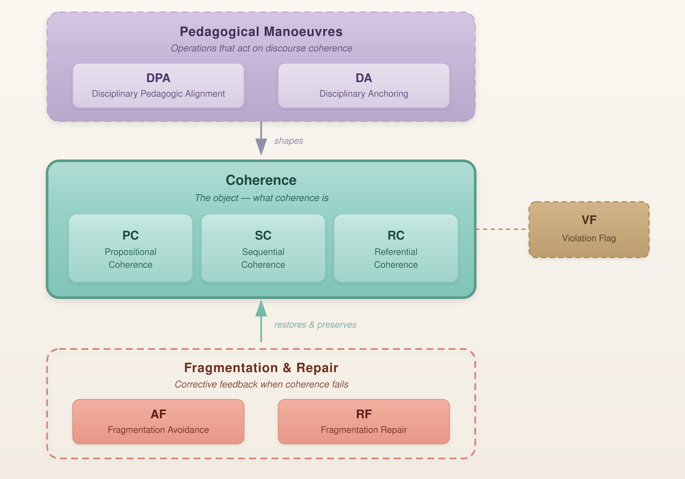

# Curriculum Coherence Evals

An open-source implementation of the **Curriculum Coherence Framework** for evaluating educational AI conversations using the **LLM-as-a-Judge** paradigm.

This repository operationalises eight interaction-level curriculum coherence dimensions informed by curriculum coherence theory, computed curriculum research, and LLM-based evaluation. It provides reusable evaluation prompts, dimension-level coding guidelines, JSON schemas, illustrative examples, and lightweight utilities for evaluating AI-generated educational conversations.

---

# Curriculum Coherence Framework

<p align="center">
  
</p>

The Curriculum Coherence Framework conceptualises curriculum coherence through four complementary components:

### Pedagogical Manoeuvres

Pedagogical manoeuvres are instructional operations that actively shape discourse coherence during an educational interaction.

- **Disciplinary-Pedagogic Alignment (DPA)**
- **Disciplinary Anchoring (DA)**

### Coherence

Coherence represents the central construct of the framework and captures whether an instructional interaction develops as a logically connected learning experience.

- **Propositional Coherence (PC)**
- **Sequential Coherence (SC)**
- **Referential Coherence (RC)**

### Fragmentation & Repair

Fragmentation and repair capture how conversational breakdowns are prevented or repaired when coherence is disrupted.

- **Fragmentation Avoidance (AF)**
- **Fragmentation Repair (RF)**

### Violation Flag

Violation Flag identifies responses containing disruptive, contradictory, or epistemically unrelated content that falls outside the intended instructional discourse.

- **Violation Flag (VF)**

---

# What this repository evaluates

Most chatbot evaluation frameworks assess broad properties such as factuality, helpfulness, safety, or toxicity.

**Curriculum Coherence Evals** instead evaluates whether an educational AI response is coherent from a curriculum perspective.

Specifically, it evaluates whether an AI response:

- builds logically on prior instructional turns;
- maintains appropriate disciplinary references;
- follows a sensible curricular sequence;
- avoids unnecessary fragmentation;
- repairs coherence after conversational breakdowns;
- remains anchored in disciplinary concepts;
- aligns pedagogical scaffolding with disciplinary knowledge; and
- avoids disruptive or epistemically unrelated content.

---

# Repository structure

```text
curriculum-coherence-evals/
│
├── README.md
├── LICENSE
├── .gitignore
├── CITATION.cff
├── references.bib
│
├── assets/
│   └── coherence_framework.jpg
│
├── framework/
│   ├── curriculum_coherence_framework.md
│   ├── coherence_dimensions.md
│   └── references.md
│
├── dimensions/
│   ├── disciplinary_pedagogic_alignment.md
│   ├── disciplinary_anchoring.md
│   ├── propositional_coherence.md
│   ├── sequential_coherence.md
│   ├── referential_coherence.md
│   ├── avoidance_of_fragmentation.md
│   ├── repair_of_fragmentation.md
│   └── violation_flag.md
│
├── prompts/
│   ├── curriculum_coherence_judge.md
│   └── single_dimension_template.md
│
├── schemas/
│   ├── evaluation_case.schema.json
│   └── judge_output.schema.json
│
├── examples/
│   ├── sample_cases.jsonl
│   └── sample_outputs.jsonl
│
└── utils/
    ├── render_prompt.py
    └── parse_output.py
```

---

# Input format

Each evaluation case contains three fields:

```json
{
  "conversation_history": "Agent: ...\nLearner: ...",
  "learner_turn": "The learner's current message.",
  "agent_turn": "The AI tutor response to evaluate."
}
```

---

# Output format

The combined evaluation prompt returns an eight-element binary vector.

```json
[1,1,1,1,1,1,1,0]
```

The dimensions are grouped conceptually according to the Curriculum Coherence Framework:

| Framework Component | Dimensions |
|--------------------|------------|
| **Pedagogical Manoeuvres** | Disciplinary-Pedagogic Alignment (DPA), Disciplinary Anchoring (DA) |
| **Coherence** | Propositional Coherence (PC), Sequential Coherence (SC), Referential Coherence (RC) |
| **Fragmentation & Repair** | Fragmentation Avoidance (AF), Fragmentation Repair (RF) |
| **Violation** | Violation Flag (VF) |

> **Note:** The exact ordering of the binary output vector is defined by the evaluation prompt being used (e.g., `curriculum_coherence_judge.md`) and should be interpreted according to that prompt.

---

# Quick start

Render a prompt for a sample evaluation case:

```bash
python utils/render_prompt.py \
  --template prompts/curriculum_coherence_judge.md \
  --case examples/sample_cases.jsonl \
  --index 0
```

Render prompts for every sample case:

```bash
python utils/render_prompt.py \
  --template prompts/curriculum_coherence_judge.md \
  --case examples/sample_cases.jsonl \
  --all
```

Parse a model response:

```bash
python utils/parse_output.py --text "[1,1,1,1,1,1,1,0]"
```

or

```bash
echo "[1,1,1,1,1,1,1,0]" | python utils/parse_output.py
```

---

# Intended use

Curriculum Coherence Evals is intended for researchers and practitioners developing or evaluating:

- educational conversational agents;
- intelligent tutoring systems;
- computed curriculum platforms;
- AI-assisted instructional design systems; and
- AI-mediated learning conversations.

Typical use cases include:

- LLM-as-a-Judge evaluation;
- human coding and rater training;
- curriculum quality assurance;
- comparison of LLM judges with expert annotations; and
- human-in-the-loop evaluation workflows.

---

# Theoretical foundations

This repository is informed by three complementary areas of research:

- **Curriculum Design Coherence**, particularly the Curriculum Design Coherence (CDC) model.
- **Computed Curriculum**, including curriculum knowledge graph and AI-driven curriculum modelling.
- **LLM-as-a-Judge**, for scalable evaluation of AI-generated educational interactions.

A curated list of foundational references is provided in [`framework/references.md`](framework/references.md).

---

# Citation

If you use this repository, please cite the repository. A citation to the accompanying publication will be added following publication.

---

# License

Released under the MIT License.